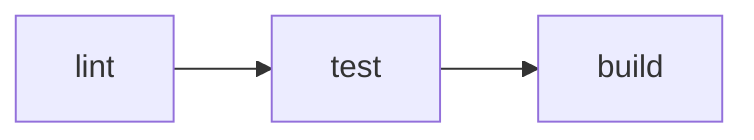

# Vite+

Vite+ is the unified toolchain and entry point for web development. It manages your runtime, package manager, and frontend toolchain in one place by combining [Vite](https://vite.dev/), [Vitest](https://vitest.dev/), [Oxlint](https://oxc.rs/docs/guide/usage/linter.html), [Oxfmt](https://oxc.rs/docs/guide/usage/formatter.html), [Rolldown](https://rolldown.rs/), [tsdown](https://tsdown.dev/), and [Vite Task](https://github.com/voidzero-dev/vite-task).

Vite+ ships in two parts: `vp`, the global command-line tool, and `vite-plus`, the local package installed in each project. If you already have a Vite project, use [`vp migrate`](/guide/migrate) to migrate it to Vite+, or paste our [migration prompt](/guide/migrate#migration-prompt) into your coding agent.

## Quick Start

Create a project, install dependencies, and use the default commands:

```bash
vp create # Create a new project
vp install # Install dependencies
vp dev # Start the dev server
vp check # Format, lint, type-check
vp test # Run JavaScript tests
vp build # Build for production
```

You can also just run `vp` on its own and use the interactive command line.

## Core Commands

Vite+ can handle the entire local frontend development cycle from starting a project, developing it, checking & testing, and building it for production.

### Start

- [`vp create`](/guide/create) creates new apps, packages, and monorepos.
- [`vp migrate`](/guide/migrate) moves existing projects onto Vite+.
- [`vp config`](/guide/commit-hooks) configures commit hooks and agent integration.
- [`vp staged`](/guide/commit-hooks) runs checks on staged files.
- [`vp install`](/guide/install) installs dependencies with the right package manager.
- [`vp env`](/guide/env) manages Node.js versions.

### Develop

- [`vp dev`](/guide/dev) starts the dev server powered by Vite.
- [`vp check`](/guide/check) runs format, lint, and type checks together.
- [`vp lint`](/guide/lint), [`vp fmt`](/guide/fmt), and [`vp test`](/guide/test) let you run those tools directly.

### Execute

- [`vp run`](/guide/run) runs tasks across workspaces with caching.
- [`vp cache`](/guide/cache) clears task cache entries.
- [`vpx`](/guide/vpx) runs binaries globally.
- [`vp exec`](/guide/vpx) runs local project binaries.
- [`vp dlx`](/guide/vpx) runs package binaries without adding them as dependencies.

### Build

- [`vp build`](/guide/build) builds apps.
- [`vp pack`](/guide/pack) builds libraries or standalone artifacts.
- [`vp preview`](/guide/build) previews the production build locally.

### Manage Dependencies

- [`vp add`](/guide/install), [`vp remove`](/guide/install), [`vp update`](/guide/install), [`vp dedupe`](/guide/install), [`vp outdated`](/guide/install), [`vp why`](/guide/install), and [`vp info`](/guide/install) wrap package-manager workflows.
- [`vp pm <command>`](/guide/install) calls other package manager commands directly.

### Maintain

- [`vp upgrade`](/guide/upgrade) updates the `vp` installation itself.
- [`vp implode`](/guide/implode) removes `vp` and related Vite+ data from your machine.

::: info
Vite+ ships with many predefined commands such as `vp build`, `vp test`, and `vp dev`. These commands are built in and cannot be changed. If you want to run a command from your `package.json` scripts, use `vp run <command>`.

[Learn more about `vp run`.](/guide/run)
:::

# Migrate to Vite+

::: important
Migration is only applicable for applications that are currently using Vite, but not using Vite+. If your application is not yet using Vite, you should adopt Vite+ directly instead of adopting Vite and then migrating to Vite+.
:::

`vp migrate` helps move existing projects onto Vite+.

## Overview

This command is the starting point for consolidating separate Vite, Vitest, Oxlint, Oxfmt, ESLint, and Prettier setups into Vite+.

Use it when you want to take an existing project and move it onto the Vite+ defaults instead of wiring each tool by hand.

## Usage

```bash
vp migrate
vp migrate <path>
vp migrate --no-interactive
```

## Target Path

The positional `PATH` argument is optional.

- If omitted, `vp migrate` migrates the current directory
- If provided, it migrates that target directory instead

```bash
vp migrate
vp migrate my-app
```

## Options

- `--agent <name>` writes agent instructions into the project
- `--no-agent` skips agent instruction setup
- `--editor <name>` writes editor config files into the project
- `--no-editor` skips editor config setup
- `--hooks` sets up pre-commit hooks
- `--no-hooks` skips hook setup
- `--no-interactive` runs the migration without prompts

## Migration Flow

The `migrate` command is designed to move existing projects onto Vite+ quickly. Here is what the command does:

- Updates project dependencies
- Rewrites imports where needed
- Merges tool-specific config into `vite.config.ts`
- Updates scripts to the Vite+ command surface
- Can set up commit hooks
- Can write agent and editor configuration files

Most projects will require further manual adjustments after running `vp migrate`.

## Recommended Workflow

Before running the migration:

- Upgrade to Vite 8+ and Vitest 4.1+ first
- Make sure you understand any existing lint, format, or test setup that should be preserved

After running the migration:

- Run `vp install`
- Run `vp check`
- Run `vp test`
- Run `vp build`

## Migration Prompt

If you want to hand this work to a coding agent (or the reader is a coding agent!), use this migration prompt:

```md
Migrate this project to Vite+. Vite+ replaces the current split tooling around runtime management, package management, dev/build/test commands, linting, formatting, and packaging. Run `vp help` to understand Vite+ capabilities and `vp help migrate` before making changes. Use `vp migrate --no-interactive` in the workspace root. Make sure the project is using Vite 8+ and Vitest 4.1+ before migrating.

After the migration:

- Confirm `vite` imports were rewritten to `vite-plus` where needed
- Confirm `vitest` imports were rewritten to `vite-plus/test` where needed
- Remove old `vite` and `vitest` dependencies only after those rewrites are confirmed
- Move remaining tool-specific config into the appropriate blocks in `vite.config.ts`

Command mapping to keep in mind:

- `vp run <script>` is the equivalent of `pnpm run <script>`
- `vp test` runs the built-in test command, while `vp run test` runs the `test` script from `package.json`
- `vp install`, `vp add`, and `vp remove` delegate through the package manager declared by `packageManager`
- `vp dev`, `vp build`, `vp preview`, `vp lint`, `vp fmt`, `vp check`, and `vp pack` replace the corresponding standalone tools
- Prefer `vp check` for validation loops

Finally, verify the migration by running: `vp install`, `vp check`, `vp test`, and `vp build`

Summarize the migration at the end and report any manual follow-up still required.
```

## Tool-Specific Migrations

### Vitest

Vitest is automatically migrated through `vp migrate`. If you are migrating manually, you have to update all the imports to `vite-plus/test` instead:

```ts
// before
import { describe, expect, it, vi } from "vitest";

const { page } = await import("@vitest/browser/context");

// after
import { describe, expect, it, vi } from "vite-plus/test";

const { page } = await import("vite-plus/test/browser/context");
```

### tsdown

If your project uses a `tsdown.config.ts`, move its options into the `pack` block in `vite.config.ts`:

```ts
// before — tsdown.config.ts
import { defineConfig } from "tsdown";

export default defineConfig({
    entry: ["src/index.ts"],
    dts: true,
    format: ["esm", "cjs"],
});

// after — vite.config.ts
import { defineConfig } from "vite-plus";

export default defineConfig({
    pack: {
        entry: ["src/index.ts"],
        dts: true,
        format: ["esm", "cjs"],
    },
});
```

After merging, delete `tsdown.config.ts`. See the [Pack guide](/guide/pack) for the full configuration reference.

### lint-staged

Vite+ replaces lint-staged with its own `staged` block in `vite.config.ts`. Only the `staged` config format is supported. Standalone `.lintstagedrc` in non-JSON format and `lint-staged.config.*` are not migrated automatically.

Move your lint-staged rules into the `staged` block:

```ts
// vite.config.ts
import { defineConfig } from "vite-plus";

export default defineConfig({
    staged: {
        "*.{js,ts,tsx,vue,svelte}": "vp check --fix",
    },
});
```

After migrating, remove lint-staged from your dependencies and delete any lint-staged config files. See the [Commit hooks guide](/guide/commit-hooks) and [Staged config reference](/config/staged) for details.

## Examples

```bash
# Migrate the current project
vp migrate

# Migrate a specific directory
vp migrate my-app

# Run without prompts
vp migrate --no-interactive

# Write agent and editor setup during migration
vp migrate --agent claude --editor zed
```

# Installing Dependencies

`vp install` installs dependencies using the current workspace's package manager.

## Overview

Use Vite+ to manage dependencies across pnpm, npm, and Yarn. Instead of switching between `pnpm install`, `npm install`, and `yarn install`, you can keep using `vp install`, `vp add`, `vp remove`, and the rest of the Vite+ package-management commands.

Vite+ detects the package manager from the workspace root in this order:

1. `packageManager` in `package.json`
2. `pnpm-workspace.yaml`
3. `pnpm-lock.yaml`
4. `yarn.lock` or `.yarnrc.yml`
5. `package-lock.json`
6. `.pnpmfile.cjs` or `pnpmfile.cjs`
7. `yarn.config.cjs`

If none of those files are present, `vp` falls back to `pnpm` by default. Vite+ automatically downloads the matching package manager and uses it for the command you ran.

## Usage

```bash
vp install
```

Common install flows:

```bash
vp install
vp install --frozen-lockfile
vp install --lockfile-only
vp install --filter web
vp install -w
```

`vp install` maps to the correct underlying install behavior for the detected package manager, including the right lockfile flags for pnpm, npm, and Yarn.

## Global Packages

Use the `-g` flag for installing, updating or removing globally installed packages:

- `vp install -g <pkg>` installs a package globally
- `vp uninstall -g <pkg>` removes a global package
- `vp update -g [pkg]` updates one global package or all of them
- `vp list -g [pkg]` lists global packages

## Managing Dependencies

Vite+ provides all the familiar package management commands:

- `vp install` installs the current dependency graph for the project
- `vp add <pkg>` adds packages to `dependencies`, use `-D` for `devDependencies`
- `vp remove <pkg>` removes packages
- `vp update` updates dependencies
- `vp dedupe` reduces duplicate dependency entries where the package manager supports it
- `vp outdated` shows available updates
- `vp list` shows installed packages
- `vp why <pkg>` explains why a package is present
- `vp info <pkg>` shows registry metadata for a package
- `vp link` and `vp unlink` manage local package links
- `vp dlx <pkg>` runs a package binary without adding it to the project
- `vp pm <command>` forwards a raw package-manager-specific command when you need behavior outside the normalized `vp` command set

### Command Guide

#### Install

Use `vp install` when you want to install exactly what the current `package.json` and lockfile describe.

- `vp install` is the standard install command
- `vp install --frozen-lockfile` fails if the lockfile would need changes
- `vp install --no-frozen-lockfile` allows lockfile updates explicitly
- `vp install --lockfile-only` updates the lockfile without performing a full install
- `vp install --prefer-offline` and `vp install --offline` prefer or require cached packages
- `vp install --ignore-scripts` skips lifecycle scripts
- `vp install --filter <pattern>` scopes install work in monorepos
- `vp install -w` installs in the workspace root

#### Global Install

Use these commands when you want package-manager-managed tools available outside a single project.

- `vp install -g typescript`
- `vp uninstall -g typescript`
- `vp update -g`
- `vp list -g`

#### Add and Remove

Use `vp add` and `vp remove` for day-to-day dependency edits instead of editing `package.json` by hand.

- `vp add react`
- `vp add -D typescript vitest`
- `vp add -O fsevents`
- `vp add --save-peer react`
- `vp remove react`
- `vp remove --filter web react`

#### Update, Dedupe, and Outdated

Use these commands to maintain the dependency graph over time.

- `vp update` refreshes packages to newer versions
- `vp outdated` shows which packages have newer versions available
- `vp dedupe` asks the package manager to collapse duplicates where possible

#### Inspect

Use these when you need to understand the current state of dependencies.

- `vp list` shows installed packages
- `vp why react` explains why `react` is installed
- `vp info react` shows registry metadata such as versions and dist-tags

#### Advanced

Use these when you need lower-level package-manager behavior.

- `vp link` and `vp unlink` manage local development links
- `vp dlx create-vite` runs a package binary without saving it as a dependency
- `vp pm <command>` forwards directly to the resolved package manager

Examples:

```bash
vp pm config get registry
vp pm cache clean --force
vp pm exec tsc --version
```

# Environment

`vp env` manages Node.js versions globally and per project.

## Overview

Managed mode is on by default, so `node`, `npm`, and related shims resolve through Vite+ and pick the right Node.js version for the current project.

By default, Vite+ stores its managed runtime and related files in `~/.vite-plus`. If needed, you can override that location with `VITE_PLUS_HOME`.

If you want to keep that behavior, run:

```bash
vp env on
```

This enables managed mode, where the shims always use the Vite+-managed Node.js installation.

If you do not want Vite+ to manage Node.js first, run:

```bash
vp env off
```

This switches to system-first mode, where the shims prefer your system Node.js and only fall back to the Vite+-managed runtime when needed.

## Commands

### Setup

- `vp env setup` creates or updates shims in `VITE_PLUS_HOME/bin`
- `vp env on` enables managed mode so shims always use Vite+-managed Node.js
- `vp env off` enables system-first mode so shims prefer system Node.js first
- `vp env print` prints the shell snippet for the current session

### Manage

- `vp env default` sets or shows the global default Node.js version
- `vp env pin` pins a Node.js version in the current directory
- `vp env unpin` removes `.node-version` from the current directory
- `vp env use` sets a Node.js version for the current shell session
- `vp env install` installs a Node.js version
- `vp env uninstall` removes an installed Node.js version
- `vp env exec` runs a command with a specific Node.js version

### Inspect

- `vp env current` shows the current resolved environment
- `vp env doctor` runs environment diagnostics
- `vp env which` shows which tool path will be used
- `vp env list` shows locally installed Node.js versions
- `vp env list-remote` shows available Node.js versions from the registry

## Project Setup

- Pin a project version with `.node-version`
- Use `vp install`, `vp dev`, and `vp build` normally
- Let Vite+ pick the right runtime for the project

## Examples

```bash
# Setup
vp env setup                  # Create shims for node, npm, npx
vp env on                     # Use Vite+ managed Node.js
vp env print                  # Print shell snippet for this session

# Manage
vp env pin lts                # Pin the project to the latest LTS release
vp env install                # Install the version from .node-version or package.json
vp env default lts            # Set the global default version
vp env use 20                 # Use Node.js 20 for the current shell session
vp env use --unset            # Remove the session override

# Inspect
vp env current                # Show current resolved environment
vp env current --json         # JSON output for automation
vp env which node             # Show which node binary will be used
vp env list-remote --lts      # List only LTS versions

# Execute
vp env exec --node lts npm i  # Execute npm with latest LTS
vp env exec node -v           # Use shim mode with automatic version resolution
```

# Running Binaries

Use `vpx`, `vp exec`, and `vp dlx` to run binaries without switching between local installs, downloaded packages, and project-specific tools.

## Overview

`vpx` executes a command from a local or remote npm package. It can run a package that is already available locally, download a package on demand, or target an explicit package version.

Use the other binary commands when you need stricter control:

- `vpx` resolves a package binary locally first and can download it when needed
- `vp exec` runs a binary from the current project's `node_modules/.bin`
- `vp dlx` runs a package binary without adding it as a dependency

## `vpx`

Use `vpx` for running any local or remote binary:

```bash
vpx <pkg[@version]> [args...]
```

### Options

- `-p, --package <name>` installs one or more packages before running the command
- `-c, --shell-mode` executes the command inside a shell
- `-s, --silent` suppresses Vite+ output and only shows the command output

### Examples

```bash
vpx eslint .
vpx create-vue my-app
vpx typescript@5.5.4 tsc --version
vpx -p cowsay -c 'echo "hi" | cowsay'
```

## `vp exec`

Use `vp exec` when the binary must come from the current project, for example a binary from a dependency installed in `node_modules/.bin`.

```bash
vp exec <command> [args...]
```

Examples:

```bash
vp exec eslint .
vp exec tsc --noEmit
```

## `vp dlx`

Use `vp dlx` for one-off package execution without adding the package to your project dependencies.

```bash
vp dlx <package> [args...]
```

Examples:

```bash
vp dlx create-vite
vp dlx typescript tsc --version
```

# Creating a Project

`vp create` interactively scaffolds new Vite+ projects, monorepos, and apps inside existing workspaces.

## Overview

The `create` command is the fastest way to start with Vite+. It can be used in a few different ways:

- Start a new Vite+ monorepo
- Create a new standalone application or library
- Add a new app or library inside an existing project

This command can be used with built-in templates, community templates, or remote GitHub templates.

## Usage

```bash
vp create
vp create <template>
vp create <template> -- <template-options>
```

## Built-in Templates

Vite+ ships with these built-in templates:

- `vite:monorepo` creates a new monorepo
- `vite:application` creates a new application
- `vite:library` creates a new library
- `vite:generator` creates a new generator

## Template Sources

`vp create` is not limited to the built-in templates.

- Use shorthand templates like `vite`, `@tanstack/start`, `svelte`, `next-app`, `nuxt`, `react-router`, and `vue`
- Use full package names like `create-vite` or `create-next-app`
- Use local templates such as `./tools/create-ui-component` or `@acme/generator-*`
- Use remote templates such as `github:user/repo` or `https://github.com/user/template-repo`

Run `vp create --list` to see the built-in templates and the common shorthand templates Vite+ recognizes.

## Options

- `--directory <dir>` writes the generated project into a specific target directory
- `--agent <name>` creates agent instructions files during scaffolding
- `--editor <name>` writes editor config files
- `--hooks` enables pre-commit hook setup
- `--no-hooks` skips hook setup
- `--no-interactive` runs without prompts
- `--verbose` shows detailed scaffolding output
- `--list` prints the available built-in and popular templates

## Template Options

Arguments after `--` are passed directly to the selected template.

This matters when the template itself accepts flags. For example, you can forward Vite template selection like this:

```bash
vp create vite -- --template react-ts
```

## Examples

```bash
# Interactive mode
vp create

# Create a Vite+ monorepo, application, library, or generator
vp create vite:monorepo
vp create vite:application
vp create vite:library
vp create vite:generator

# Use shorthand community templates
vp create vite
vp create @tanstack/start
vp create svelte

# Use full package names
vp create create-vite
vp create create-next-app

# Use remote templates
vp create github:user/repo
vp create https://github.com/user/template-repo
```

# Build

`vp build` builds Vite applications for production.

## Overview

`vp build` runs the standard Vite production build through Vite+. Since it is directly based on Vite, the build pipeline and configuration model are the same as Vite. For more information about how Vite production builds work, see the [Vite guide](https://vite.dev/guide/build). Note that Vite+ uses Vite 8 and [Rolldown](https://rolldown.rs/) for builds.

::: info
`vp build` always runs the built-in Vite production build. If your project also has a `build` script in `package.json`, run `vp run build` when you want to run that script instead.
:::

## Usage

```bash
vp build
vp build --watch
vp build --sourcemap
```

## Configuration

Use standard Vite configuration in `vite.config.ts`. For the full configuration reference, see the [Vite config docs](https://vite.dev/config/).

Use it for:

- [plugins](https://vite.dev/guide/using-plugins)
- [aliases](https://vite.dev/config/shared-options#resolve-alias)
- [`build`](https://vite.dev/config/build-options)
- [`preview`](https://vite.dev/config/preview-options)
- [environment modes](https://vite.dev/guide/env-and-mode)

## Preview

Use `vp preview` to serve the production build locally after `vp build`.

```bash
vp build
vp preview
```

# Dev

`vp dev` starts the Vite development server.

## Overview

`vp dev` runs the standard Vite development server through Vite+, so you keep the normal Vite dev experience while using the same CLI entry point as the rest of the toolchain. For more information about using and configuring the dev server, see the [Vite guide](https://vite.dev/guide/).

## Usage

```bash
vp dev
```

## Configuration

Use standard Vite config in `vite.config.ts`. For the full configuration reference, see the [Vite config docs](https://vite.dev/config/).

Use it for:

- [plugins](https://vite.dev/guide/using-plugins)
- [aliases](https://vite.dev/config/shared-options#resolve-alias)
- [`server`](https://vite.dev/config/server-options)
- [environment modes](https://vite.dev/guide/env-and-mode)

# Pack

`vp pack` builds libraries for production with [tsdown](https://tsdown.dev/guide/).

## Overview

`vp pack` builds libraries and standalone executables with tsdown. Use it for publishable packages and binary outputs. If you want to build a web application, use `vp build`. `vp pack` covers everything you need for building libraries out of the box, including declaration file generation, multiple output formats, source maps, and minification.

For more information about how tsdown works, see the official [tsdown guide](https://tsdown.dev/guide/).

## Usage

```bash
vp pack
vp pack src/index.ts --dts
vp pack --watch
```

## Configuration

Put packaging configuration directly in the `pack` block in `vite.config.ts` so all your configuration stays in one place. We do not recommend using `tsdown.config.ts` with Vite+.

See the [tsdown guide](https://tsdown.dev/guide/) and the [tsdown config file docs](https://tsdown.dev/options/config-file) to learn more about how to use and configure `vp pack`.

Use it for:

- [declaration files (`dts`)](https://tsdown.dev/options/dts)
- [output formats](https://tsdown.dev/options/output-format)
- [watch mode](https://tsdown.dev/options/watch-mode)
- [standalone executables](https://tsdown.dev/options/exe#executable)

```ts
import { defineConfig } from "vite-plus";

export default defineConfig({
    pack: {
        dts: true,
        format: ["esm", "cjs"],
        sourcemap: true,
    },
});
```

## Standalone Executables

`vp pack` can also build standalone executables through tsdown's experimental [`exe` option](https://tsdown.dev/options/exe#executable).

Use this when you want to ship a CLI or other Node-based tool as a native executable that runs without requiring Node.js to be installed separately.

```ts
import { defineConfig } from "vite-plus";

export default defineConfig({
    pack: {
        entry: ["src/cli.ts"],
        exe: true,
    },
});
```

See the official [tsdown executable docs](https://tsdown.dev/options/exe#executable) for details about configuring custom file names, embedded assets, and cross-platform targets.

# Run

`vp run` runs `package.json` scripts and tasks defined in `vite.config.ts`. It works like `pnpm run`, with caching, dependency ordering, and workspace-aware execution built in.

## Overview

Use `vp run` with existing `package.json` scripts:

```json [package.json]
{
    "scripts": {
        "build": "node compile-legacy-app.js",
        "test": "jest"
    }
}
```

`vp run build` executes the associated build script:

```
$ node compile-legacy-app.js

building legacy app for production...

✓ built in 69s
```

Use `vp run` without a task name to use the interactive task runner:

```
Select a task (↑/↓, Enter to run, Esc to clear):

  › build: node compile-legacy-app.js
    test: jest
```

## Caching

`package.json` scripts are not cached by default. Use `--cache` to enable caching:

```bash
vp run --cache build
```

```
$ node compile-legacy-app.js
✓ built in 69s
```

If nothing changes, the output is replayed from the cache on the next run:

```
$ node compile-legacy-app.js ✓ cache hit, replaying
✓ built in 69s

---
vp run: cache hit, 69s saved.
```

If an input changes, the task runs again:

```
$ node compile-legacy-app.js ✗ cache miss: 'legacy/index.js' modified, executing
```

## Task Definitions

Vite Task automatically tracks which files your command uses. You can define tasks directly in `vite.config.ts` to enable caching by default or control which files and environment variables affect cache behavior.

```ts
import { defineConfig } from "vite-plus";

export default defineConfig({
    run: {
        tasks: {
            build: {
                command: "vp build",
                dependsOn: ["lint"],
                env: ["NODE_ENV"],
            },
            deploy: {
                command: "deploy-script --prod",
                cache: false,
                dependsOn: ["build", "test"],
            },
        },
    },
});
```

If you want to run an existing `package.json` script as-is, use `vp run <script>`. If you want task-level caching, dependencies, or environment/input controls, define a task with an explicit `command`. A task name can come from `vite.config.ts` or `package.json`, but not both.

::: info
Tasks defined in `vite.config.ts` are cached by default. `package.json` scripts are not. See [When Is Caching Enabled?](/guide/cache#when-is-caching-enabled) for the full resolution order.
:::

See [Run Config](/config/run) for the full `run` block reference.

## Task Dependencies

Use [`dependsOn`](#depends-on) to run tasks in the right order. Running `vp run deploy` with the config above runs `build` and `test` first. Dependencies can also target other packages in the same project with the `package#task` notation:

```ts
dependsOn: ["@my/core#build", "@my/utils#lint"];
```

## Running in a Workspace

With no package-selection flags, `vp run` runs the task in the package in your current working directory:

```bash
cd packages/app
vp run build
```

You can also target a package explicitly from anywhere:

```bash
vp run @my/app#build
```

Workspace package ordering is based on the normal monorepo dependency graph declared in each package's `package.json`. In other words, when Vite+ talks about package dependencies, it means the regular `dependencies` relationships between workspace packages, not a separate task-runner-specific graph.

### Recursive (`-r`)

Run the task in every workspace package, in dependency order:

```bash
vp run -r build
```

That dependency order comes from the workspace packages referenced through `package.json` dependencies.

### Transitive (`-t`)

Run the task in one package and all of its dependencies:

```bash
vp run -t @my/app#build
```

If `@my/app` depends on `@my/utils`, which depends on `@my/core`, this runs all three in order. Vite+ resolves that chain from the normal workspace package dependencies declared in `package.json`.

### Filter (`--filter`)

Select packages by name, directory, or glob pattern. The syntax matches pnpm's `--filter`:

```bash
# By name
vp run --filter @my/app build

# By glob
vp run --filter "@my/*" build

# By directory
vp run --filter ./packages/app build

# Include dependencies
vp run --filter "@my/app..." build

# Include dependents
vp run --filter "...@my/core" build

# Exclude packages
vp run --filter "@my/*" --filter "!@my/utils" build
```

Multiple `--filter` flags are combined as a union. Exclusion filters are applied after all inclusions.

### Workspace Root (`-w`)

Explicitly run the task in the workspace root package:

```bash
vp run -w build
```

## Compound Commands

Commands joined with `&&` are split into independent sub-tasks. Each sub-task is cached separately when [caching is enabled](/guide/cache#when-is-caching-enabled). This works for both `vite.config.ts` tasks and `package.json` scripts:

```json [package.json]
{
    "scripts": {
        "check": "vp lint && vp build"
    }
}
```

Now, run `vp run --cache check`:

```
$ vp lint
Found 0 warnings and 0 errors.

$ vp build
✓ built in 28ms

---
vp run: 0/2 cache hit (0%).
```

Each sub-task has its own cache entry. If only `.ts` files changed but lint still passes, only `vp build` runs again the next time `vp run --cache check` is called:

```
$ vp lint ✓ cache hit, replaying
$ vp build ✗ cache miss: 'src/index.ts' modified, executing
✓ built in 30ms

---
vp run: 1/2 cache hit (50%), 120ms saved.
```

### Nested `vp run`

When a command contains `vp run`, Vite Task inlines it as separate tasks instead of spawning a nested process. Each sub-task is cached independently and output stays flat:

```json [package.json]
{
    "scripts": {
        "ci": "vp run lint && vp run test && vp run build"
    }
}
```

Running `vp run ci` expands into three tasks:



Flags also work inside nested scripts. For example, `vp run -r build` inside a script expands into individual build tasks for every package.

::: info
A common monorepo pattern is a root script that runs a task recursively:

```json [package.json (root)]
{
    "scripts": {
        "build": "vp run -r build"
    }
}
```

This creates a potential recursion: root's `build` -> `vp run -r build` -> includes root's `build` -> ...

Vite Task detects this and prunes the self-reference automatically, so other packages build normally.
:::

## Execution Summary

Use `-v` to show a detailed execution summary:

```bash
vp run -r -v build
```

```
━━━━━━━━━━━━━━━━━━━━━━━━━━━━━━━━━━━━━━━━━━━━━━━
    Vite+ Task Runner • Execution Summary
━━━━━━━━━━━━━━━━━━━━━━━━━━━━━━━━━━━━━━━━━━━━━━━

Statistics:   3 tasks • 3 cache hits • 0 cache misses
Performance:  100% cache hit rate, 468ms saved in total

Task Details:
────────────────────────────────────────────────
  [1] @my/core#build: ~/packages/core$ vp build ✓
      → Cache hit - output replayed - 200ms saved
  ·······················································
  [2] @my/utils#build: ~/packages/utils$ vp build ✓
      → Cache hit - output replayed - 150ms saved
  ·······················································
  [3] @my/app#build: ~/packages/app$ vp build ✓
      → Cache hit - output replayed - 118ms saved
━━━━━━━━━━━━━━━━━━━━━━━━━━━━━━━━━━━━━━━━━━━━━━━
```

Use `--last-details` to show the summary from the last run without running tasks again:

```bash
vp run --last-details
```

## Additional Arguments

Arguments after the task name are passed through to the task command:

```bash
vp run test --reporter verbose
```

# Task Caching

Vite Task can automatically track dependencies and cache tasks run through `vp run`.

## Overview

When a task runs successfully (exit code 0), its terminal output (stdout/stderr) is saved. On the next run, Vite Task checks if anything changed:

1. **Arguments:** did the [additional arguments](/guide/run#additional-arguments) passed to the task change?
2. **Environment variables:** did any [fingerprinted env vars](/config/run#env) change?
3. **Input files:** did any file that the command reads change?

If everything matches, the cached output is replayed instantly, and the command does not run.

::: info
Currently, only terminal output is cached and replayed. Output files such as `dist/` are not cached. If you delete them, use `--no-cache` to force a re-run. Output file caching is planned for a future release.
:::

When a cache miss occurs, Vite Task tells you exactly why:

```
$ vp lint ✗ cache miss: 'src/utils.ts' modified, executing
$ vp build ✗ cache miss: env changed, executing
$ vp test ✗ cache miss: args changed, executing
```

## When Is Caching Enabled?

A command run by `vp run` is either a **task** defined in `vite.config.ts` or a **script** defined in `package.json`. Task names and script names cannot overlap. By default, **tasks are cached and scripts are not.**

There are three types of controls for task caching, in order:

### 1. Per-task `cache: false`

A task can set [`cache: false`](/config/run#cache) to opt out. This cannot be overridden by any other cache control flag.

### 2. CLI flags

`--no-cache` disables caching for everything. `--cache` enables caching for both tasks and scripts, which is equivalent to setting [`run.cache: true`](/config/run#run-cache) for that invocation.

### 3. Workspace config

The [`run.cache`](/config/run#run-cache) option in your root `vite.config.ts` controls the default for each category:

| Setting         | Default | Effect                                  |
| --------------- | ------- | --------------------------------------- |
| `cache.tasks`   | `true`  | Cache tasks defined in `vite.config.ts` |
| `cache.scripts` | `false` | Cache `package.json` scripts            |

## Automatic File Tracking

Vite Task tracks which files each command reads during execution. When a task runs, it records which files the process opens, such as your `.ts` source files, `vite.config.ts`, and `package.json`, and records their content hashes. On the next run, it re-checks those hashes to determine if anything changed.

This means caching works out of the box for most commands without any configuration. Vite Task also records:

- **Missing files:** if a command probes for a file that doesn't exist, such as `utils.ts` during module resolution, creating that file later correctly invalidates the cache.
- **Directory listings:** if a command scans a directory, such as a test runner looking for `*.test.ts`, adding or removing files in that directory invalidates the cache.

### Avoiding Overly Broad Input Tracking

Automatic tracking can sometimes include more files than necessary, causing unnecessary cache misses:

- **Tool cache files:** some tools maintain their own cache, such as TypeScript's `.tsbuildinfo` or Cargo's `target/`. These files may change between runs even when your source code has not, causing unnecessary cache invalidation.
- **Directory listings:** when a command scans a directory, such as when globbing for `**/*.js`, Vite Task sees the directory read but not the glob pattern. Any file added or removed in that directory, even unrelated ones, invalidates the cache.

Use the [`input`](/config/run#input) option to exclude files or to replace automatic tracking with explicit file patterns:

```ts
tasks: {
  build: {
    command: 'tsc',
    input: [{ auto: true }, '!**/*.tsbuildinfo'],
  },
}
```

## Environment Variables

By default, tasks run in a clean environment. Only a small set of common variables, such as `PATH`, `HOME`, and `CI`, are passed through. Other environment variables are neither visible to the task nor included in the cache fingerprint.

To add an environment variable to the cache key, add it to [`env`](/config/run#env). Changing its value then invalidates the cache:

```ts
tasks: {
  build: {
    command: 'webpack --mode production',
    env: ['NODE_ENV'],
  },
}
```

To pass a variable to the task **without** affecting cache behavior, use [`untrackedEnv`](/config/run#untracked-env). This is useful for variables like `CI` or `GITHUB_ACTIONS` that should be available in the task, but do not generally affect caching behavior.

See [Run Config](/config/run#env) for details on wildcard patterns and the full list of automatically passed-through variables.

## Cache Sharing

Vite Task's cache is content-based. If two tasks run the same command with the same inputs, they share the cache entry. This happens naturally when multiple tasks include a common step, either as standalone tasks or as parts of [compound commands](/guide/run#compound-commands):

```json [package.json]
{
    "scripts": {
        "check": "vp lint && vp build",
        "release": "vp lint && deploy-script"
    }
}
```

With caching enabled, for example through `--cache` or [`run.cache.scripts: true`](/config/run#run-cache), running `check` first means the `vp lint` step in `release` is an instant cache hit, since both run the same command against the same files.

## Cache Commands

Use `vp cache clean` when you need to clear cached task results:

```bash
vp cache clean
```

The task cache is stored in `node_modules/.vite/task-cache` at the project root. `vp cache clean` deletes that cache directory.

# Format

`vp fmt` formats code with Oxfmt.

## Overview

`vp fmt` is built on [Oxfmt](https://oxc.rs/docs/guide/usage/formatter.html), the Oxc formatter. Oxfmt has full Prettier compatibility and is designed as a fast drop-in replacement for Prettier.

Use `vp fmt` to format your project, and `vp check` to format, lint and type-check all at once.

## Usage

```bash
vp fmt
vp fmt --check
vp fmt . --write
```

## Configuration

Put formatting configuration directly in the `fmt` block in `vite.config.ts` so all your configuration stays in one place. We do not recommend using `.oxfmtrc.json` with Vite+.

For editors, point the formatter config path at `./vite.config.ts` so format-on-save uses the same `fmt` block:

```json
{
    "oxc.fmt.configPath": "./vite.config.ts"
}
```

For the upstream formatter behavior and configuration reference, see the [Oxfmt docs](https://oxc.rs/docs/guide/usage/formatter.html).

```ts
import { defineConfig } from "vite-plus";

export default defineConfig({
    fmt: {
        singleQuote: true,
    },
});
```

# Lint

`vp lint` lints code with Oxlint.

## Overview

`vp lint` is built on [Oxlint](https://oxc.rs/docs/guide/usage/linter.html), the Oxc linter. Oxlint is designed as a fast replacement for ESLint for most frontend projects and ships with built-in support for core ESLint rules and many popular community rules.

Use `vp lint` to lint your project, and `vp check` to format, lint and type-check all at once.

## Usage

```bash
vp lint
vp lint --fix
vp lint --type-aware
```

## Configuration

Put lint configuration directly in the `lint` block in `vite.config.ts` so all your configuration stays in one place. We do not recommend using `oxlint.config.ts` or `.oxlintrc.json` with Vite+.

For the upstream rule set, options, and compatibility details, see the [Oxlint docs](https://oxc.rs/docs/guide/usage/linter.html).

```ts
import { defineConfig } from "vite-plus";

export default defineConfig({
    lint: {
        ignorePatterns: ["dist/**"],
        options: {
            typeAware: true,
            typeCheck: true,
        },
    },
});
```

## Type-Aware Linting

We recommend enabling both `typeAware` and `typeCheck` in the `lint` block:

- `typeAware: true` enables rules that require TypeScript type information
- `typeCheck: true` enables full type checking during linting

This path is powered by [tsgolint](https://github.com/oxc-project/tsgolint) on top of the TypeScript Go toolchain. It gives Oxlint access to type information and allows type checking directly via `vp lint` and `vp check`.

## JS Plugins

If you are migrating from ESLint and still depend on a few critical JavaScript-based ESLint plugins, Oxlint has [JS plugin support](https://oxc.rs/docs/guide/usage/linter/js-plugins) that can help you keep those plugins running while you complete the migration.

# Check

`vp check` runs format, lint, and type checks together.

## Overview

`vp check` is the default command for fast static checks in Vite+. It brings together formatting through [Oxfmt](https://oxc.rs/docs/guide/usage/formatter.html), linting through [Oxlint](https://oxc.rs/docs/guide/usage/linter.html), and TypeScript type checks through [tsgolint](https://github.com/oxc-project/tsgolint). By merging all of these tasks into a single command, `vp check` is faster than running formatting, linting, and type checking as separate tools in separate commands.

When `typeCheck` is enabled in the `lint.options` block in `vite.config.ts`, `vp check` also runs TypeScript type checks through the Oxlint type-aware path powered by the TypeScript Go toolchain and [tsgolint](https://github.com/oxc-project/tsgolint). `vp create` and `vp migrate` enable both `typeAware` and `typeCheck` by default.

We recommend turning `typeCheck` on so `vp check` becomes the single command for static checks during development.

## Usage

```bash
vp check
vp check --fix # Format and run autofixers.
```

## Configuration

`vp check` uses the same configuration you already define for linting and formatting:

- [`lint`](/guide/lint#configuration) block in `vite.config.ts`
- [`fmt`](/guide/fmt#configuration) block in `vite.config.ts`
- TypeScript project structure and tsconfig files for type-aware linting

Recommended base `lint` config:

```ts
import { defineConfig } from "vite-plus";

export default defineConfig({
    lint: {
        options: {
            typeAware: true,
            typeCheck: true,
        },
    },
});
```

# Test

`vp test` runs tests with [Vitest](https://vitest.dev).

## Overview

`vp test` is built on [Vitest](https://vitest.dev/), so you get a Vite-native test runner that reuses your Vite config and plugins, supports Jest-style expectations, snapshots, and coverage, and handles modern ESM, TypeScript, and JSX projects cleanly.

## Usage

```bash
vp test
vp test watch
vp test run --coverage
```

::: info
Unlike Vitest on its own, `vp test` does not stay in watch mode by default. Use `vp test` when you want a normal test run, and use `vp test watch` when you want to jump into watch mode.
:::

## Configuration

Put test configuration directly in the `test` block in `vite.config.ts` so all your configuration stays in one place. We do not recommend using `vitest.config.ts` with Vite+.

```ts
import { defineConfig } from "vite-plus";

export default defineConfig({
    test: {
        include: ["src/**/*.test.ts"],
    },
});
```

For the full Vitest configuration reference, see the [Vitest config docs](https://vitest.dev/config/).
